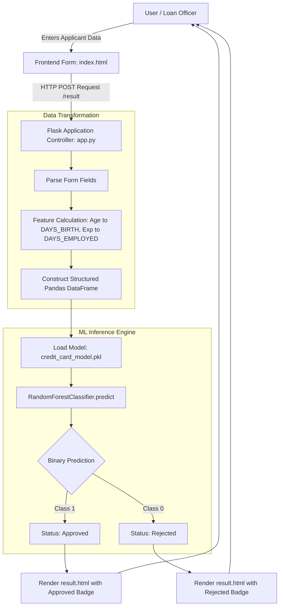

# 💳 Credit Card Approval Prediction System

[](https://www.python.org/)
[](https://flask.palletsprojects.com/)
[](https://scikit-learn.org/)
[](https://pandas.pydata.org/)
[](https://getbootstrap.com/)
[]()
[]()
[](LICENSE)

An end-to-end Machine Learning web application designed to automate and streamline the credit card underwriting and risk assessment process for financial institutions. By analyzing applicant financial profiles, socio-demographic indicators, and historical credit behavior, the system delivers real-time, data-backed approval and rejection decisions.

---

## 📌 Table of Contents

- [Executive Summary](#-executive-summary)
- [Key Features](#-key-features)
- [System Architecture](#-system-architecture)
- [Machine Learning Workflow](#-machine-learning-workflow)
  - [Dataset & Preprocessing](#dataset--preprocessing)
  - [Feature Engineering & Schema](#feature-engineering--schema)
  - [Model Evaluation & Benchmarking](#model-evaluation--benchmarking)
  - [Feature Importance](#feature-importance)
- [Project Directory Structure](#-project-directory-structure)
- [Installation & Local Setup](#-installation--local-setup)
- [Application Usage & Test Scenarios](#-application-usage--test-scenarios)
- [Software Development Life Cycle (SDLC) Documentation](#-software-development-life-cycle-sdlc-documentation)
- [Scalability & Future Roadmap](#-scalability--future-roadmap)
- [Author & Acknowledgments](#-author--acknowledgments)

---

## 📖 Executive Summary

Evaluating credit risk manually is a time-consuming, expensive, and error-prone endeavor for financial institutions. Manual underwriting introduces subjectivity, delays decision-making, and often struggles to detect subtle patterns in large applicant pools.

The **Credit Card Approval Prediction System** solves this challenge by deploying a trained **Random Forest Classifier** wrapped in a lightweight, responsive **Flask** web application. Financial analysts or applicants can input demographic and financial parameters to receive an instant, accurate creditworthiness assessment.

### Core Objectives:
- **Minimize Credit Default Risk:** Identify high-risk applicants early using historical repayment tendencies and financial status.
- **Accelerate Turnaround Time:** Transition from multi-day manual checks to instantaneous (<50ms) inference.
- **Consistent & Unbiased Underwriting:** Apply consistent, objective scoring rules to every applicant.

---

## ✨ Key Features

- **Intuitive Web Interface:** Built with Bootstrap 5.3, FontAwesome icons, custom animations, and responsive layouts tailored for mobile, tablet, and desktop screens.
- **Robust Feature Preprocessing:** Automatically maps user inputs (e.g., age in years to birth days, experience to employment days, categorical encodings) into exact mathematical feature vectors expected by the model.
- **High-Accuracy Classification:** Employs an optimized Random Forest model achieving **86.40% accuracy** and an **Out-Of-Bag (OOB) score of 85.48%**.
- **Real-Time Instant Inference:** Synchronous POST request pipeline returning approval status, styled result badges, and personalized feedback.
- **Comprehensive SDLC Lifecycle:** Complete documentation spanning 8 phases (Ideation, Requirement Analysis, Architecture Design, Planning, Development, Testing, Reporting, and Demonstration).

---

## 🏛 System Architecture

The following diagram illustrates the end-to-end data flow from user submission to model inference and result rendering:



---

## 🔬 Machine Learning Workflow

### Dataset & Preprocessing

The model is trained on the comprehensive **Credit Card Approval Dataset** (combining applicant demographic records with historical monthly payment tracking).

1. **Deduplication:** Identified and eliminated duplicate applicant profiles to avoid overfitting.
2. **Missing Value Imputation:** Handled missing occupational records by categorizing unrecorded fields into an `'Others'` classification category.
3. **Target Definition (`STATUS_BIN`):** 
   - Good standing / creditworthy (`1`): Applicants with consistent repayments and no prolonged delinquency.
   - High risk / defaulted (`0`): Applicants with overdue balances exceeding 60–90 days or write-offs.
4. **Stratified Split:** Evaluated using an 80/20 train-test split stratified on the target class to preserve distribution balance.

### Feature Engineering & Schema

The model evaluates **14 core features** mapped into exact numerical representations:

| Feature Name | Description | Value Type / Mapping |
| :--- | :--- | :--- |
| `CODE_GENDER` | Applicant gender | `0`: Female, `1`: Male |
| `FLAG_OWN_CAR` | Vehicle ownership flag | `0`: No, `1`: Yes |
| `FLAG_OWN_REALTY` | Real estate / property ownership | `0`: No, `1`: Yes |
| `CNT_CHILDREN` | Number of dependent children | Integer (e.g., `0, 1, 2+`) |
| `AMT_INCOME_TOTAL` | Annual income | Floating point (USD / Local Currency) |
| `NAME_INCOME_TYPE` | Income source category | `0`: Commercial, `1`: Pensioner, `2`: State Servant, `3`: Student, `4`: Working |
| `NAME_EDUCATION_TYPE` | Educational attainment | `0`: Academic, `1`: Higher, `2`: Incomplete Higher, `3`: Lower Secondary, `4`: Secondary |
| `NAME_FAMILY_STATUS` | Marital / family status | `0`: Civil Marriage, `1`: Married, `2`: Separated, `3`: Single, `4`: Widow |
| `NAME_HOUSING_TYPE` | Housing condition | `0`: House/Apt, `1`: With Parents, `2`: Municipal, `3`: Rented, `4`: Office, `5`: Co-op |
| `DAYS_BIRTH` | Applicant age in days | Negative or calculated as `Age * 365` |
| `DAYS_EMPLOYED` | Employment length in days | Calculated as `Experience * 365` (Set to `365243` for Pensioners) |
| `OCCUPATION_TYPE` | Occupational classification | Integer code `0` to `17` (e.g., Accountants, Tech, Managers, Others) |
| `CNT_FAM_MEMBERS` | Total family members count | Numeric (e.g., `1.0, 2.0, 3.0+`) |
| `window` | Credit history vintage window | Number of months applicant's credit history has been tracked |

### Model Evaluation & Benchmarking

Three distinct supervised classification algorithms were implemented, tuned, and benchmarked:

| Model Algorithm | Accuracy | Precision (Class 1) | Recall (Class 1) | Macro F1 | ROC-AUC | Status |
| :--- | :---: | :---: | :---: | :---: | :---: | :---: |
| **Logistic Regression** | 60.00% | 0.15 | 0.52 | 0.48 | 0.5700 | Baseline |
| **Decision Tree** | 85.00% | 0.39 | 0.39 | 0.65 | 0.6550 | Candidate |
| **Random Forest (Champion)** | **86.40%** | **0.43** | **0.44** | **0.68** | **0.7822** | **Selected** |

> **Key Takeaway:** The **Random Forest Classifier** achieved the strongest balance of predictive accuracy (86.40%), generalizability (Out-Of-Bag score: 85.48%), and discriminative power (ROC-AUC: 0.7822).

### Feature Importance

Feature importance extraction from the Random Forest model reveals the primary factors driving underwriting decisions:

```
Credit Window (vintage)  ████████████████████████████   22.31%
Age (DAYS_BIRTH)         ██████████████████████         18.23%
Work Experience          ███████████████████            15.50%
Total Annual Income      ███████████████                12.64%
Occupation Type          █████████                       7.70%
Family Status            ████                            3.49%
Income Type              ████                            3.29%
Family Members Count     ████                            3.18%
Education Level          ████                            3.07%
Children Count           ███                             2.33%
Car Ownership            ███                             2.27%
Housing Type             ███                             2.14%
Realty Ownership         ██                              2.01%
Gender                   ██                              1.85%
```

---

## 📂 Project Directory Structure

```text
credit-card-approval-prediction/
├── .gitignore                                      # Ignored build, virtual environment, and cache files
├── README.md                                       # Comprehensive project documentation
│
└── credit-card-approval-prediction-main/           # Application source & SDLC deliverables
    ├── app.py                                      # Flask server and routing controller
    ├── credit_card_model.pkl                       # Serialized trained Random Forest ML model
    ├── credit_card_approval_prediction.ipynb       # Jupyter notebook with EDA, training & evaluation
    ├── requirements.txt                            # Python package dependencies
    ├── runtime.txt                                 # Environment runtime specification
    │
    ├── templates/                                  # HTML Templates (Jinja2)
    │   ├── home.html                               # Modern landing & overview page
    │   ├── index.html                              # Interactive applicant prediction form
    │   └── result.html                             # Approval / rejection decision report
    │
    ├── static/                                     # Static frontend assets
    │   ├── css/
    │   │   └── style.css                           # Custom styling, animations & responsive typography
    │   └── js/
    │       └── script.js                           # Client-side input validation & UI feedback
    │
    ├── 1. Brainstorming & Ideation/                # Problem formulation & empathy maps
    ├── 2. Requirement Analysis/                    # Customer journey & data flow diagrams (DFD)
    ├── 3. Project Design Phase/                    # Problem-solution fit & architectural blueprints
    ├── 4. Project Planning Phase/                  # Project roadmap, milestones & schedule
    ├── 5. Project Development Phase/               # Code readability & functional feature analysis
    ├── 6.Project Testing/                          # Performance & unit testing documentation
    ├── 7.Project Documentation/                    # Comprehensive system reports & executable guides
    └── 8.Project Demonstration/                    # Demo scripts, scalability & future roadmap
```

---

## 🚀 Installation & Local Setup

Follow these steps to run the application locally on your machine:

### 1. Clone the Repository
```bash
git clone https://github.com/Akash-max-svg/credit-card-approval-prediction.git
cd credit-card-approval-prediction
```

### 2. Create and Activate a Virtual Environment
```bash
# Windows (PowerShell)
python -m venv venv
.\venv\Scripts\Activate.ps1

# Linux / macOS
python3 -m venv venv
source venv/bin/activate
```

### 3. Install Dependencies
```bash
cd credit-card-approval-prediction-main
pip install --upgrade pip
pip install -r requirements.txt
```

### 4. Run the Flask Web Application
```bash
python app.py
```

### 5. Access in Your Browser
Open your browser and navigate to:
```
http://127.0.0.1:5000/
```

---

## 🧪 Application Usage & Test Scenarios

To verify both branches of the model (Approval vs Rejection), input the following verified test cases directly on the `/predict` page:

### Scenario A: Successful Approval Case ✅
| Field | Test Input Value |
| :--- | :--- |
| **Gender** | Female |
| **Own Car** | No |
| **Own Realty** | No |
| **Children** | 0 |
| **Annual Income** | $54,000 |
| **Income Type** | Pensioner |
| **Education** | Higher Education |
| **Family Status** | Married |
| **Housing Type** | House / Apartment |
| **Age** | 62 years |
| **Experience** | 40 years *(Auto-handled for Pensioners)* |
| **Occupation** | Others |
| **Family Members** | 2 |
| **Credit History Window** | 42 months |
| **Expected Result** | **APPROVED (Class 1)** |

---

### Scenario B: Rejection Case ❌
| Field | Test Input Value |
| :--- | :--- |
| **Gender** | Female |
| **Own Car** | No |
| **Own Realty** | No |
| **Children** | 1 |
| **Annual Income** | $157,500 |
| **Income Type** | Working |
| **Education** | Higher Education |
| **Family Status** | Married |
| **Housing Type** | House / Apartment |
| **Age** | 37 years |
| **Experience** | 8 years |
| **Occupation** | Accountants (Code 0) |
| **Family Members** | 3 |
| **Credit History Window** | 12 months |
| **Expected Result** | **REJECTED (Class 0)** |

*(Note: Even with a higher income, shorter credit history windows and larger family obligations present higher statistical credit risk.)*

---

## 📑 Software Development Life Cycle (SDLC) Documentation

This project adheres strictly to standard software engineering best practices with full phase documentation available in their respective directories:

1. **Phase 1: Brainstorming & Ideation**
   - Problem statement formulation in credit card risk evaluation
   - Empathy maps identifying bank managers' and applicants' pain points
   - Idea prioritization matrix for machine learning interventions
2. **Phase 2: Requirement Analysis**
   - Complete Data Flow Diagrams (DFD Level 0 & Level 1)
   - Customer Journey Map detailing applicant application lifecycle
   - Detailed functional and technical requirements specification
3. **Phase 3: Project Design**
   - High-level and component-level solution architecture
   - Problem-solution fit mapping business KPIs to ML metrics
4. **Phase 4: Project Planning**
   - Sprint milestones, work breakdown structure (WBS), and resource scheduling
5. **Phase 5: Project Development**
   - Code readability, modularity, and feature engineering guidelines
   - Model persistence using `joblib`
6. **Phase 6: Project Testing**
   - Performance testing, latency benchmarking, and confusion matrix validation
7. **Phase 7: Project Documentation**
   - Project executable guides and technical reporting
8. **Phase 8: Project Demonstration**
   - Demo scripts, communication guides, and long-term scalability roadmap

---

## 🔮 Scalability & Future Roadmap

- [ ] **Explainable AI (XAI):** Integrate SHAP (SHapley Additive exPlanations) or LIME to provide transparent, feature-level rationale for individual approval/rejection outcomes.
- [ ] **Advanced Ensemble Models:** Benchmark gradient boosted frameworks like **LightGBM**, **XGBoost**, and **CatBoost** with Bayesian hyperparameter optimization.
- [ ] **Dockerization & Kubernetes:** Containerize using Docker and define Helm charts for automated cloud orchestration.
- [ ] **Credit Bureau API Integration:** Seamless REST API connectors to pull real-time FICO/CIBIL credit reports.
- [ ] **Automated CI/CD:** GitHub Actions workflows for continuous integration, model drift testing, and zero-downtime deployment.

---

## 👤 Author & Acknowledgments

- **Lead Developer / Author:** [Akash-max-svg](https://github.com/Akash-max-svg)
- **Repository:** [credit-card-approval-prediction](https://github.com/Akash-max-svg/credit-card-approval-prediction)
- **Frameworks & Libraries:** Built with Scikit-Learn, Flask, Pandas, and Bootstrap.

---

<p align="center">
  <b>⭐ If you find this repository helpful, please consider starring it on GitHub! ⭐</b>
</p>
